# Fast Food list app

Una empresa pyme de comidas rápidas que tiene un local en la ciudad recurre a nosotros para solicitarnos el
desarrollo de un software para su negocio.

Realizado el análisis de requerimientos con el responsable del local, se ha determinado necesario registrar los
siguientes datos:

De las comidas rápidas que ofrecen en el menú:
````
● Código de Identificación (código número entero positivo).

● Descripción (nombre de la comida).

● Precio (en Pesos Argentinos).

● Tiempo de elaboración (en minutos).

● Calorías (en gramos).

● Vegana (Si o No).
````
## Requerimientos que se deberán programar en C#.

La información debe ser registrada en un único archivo en formato JSON.

Se debe contar con interfaces de usuario interactivas que permitan acceder a las siguientes opciones (debajo
adjuntamos un ejemplo):

1. En referencia a las comidas rápidas:
 ````
● Mostrar las existentes.

● Agregar una nueva.

● Modificar los datos existentes.

● Borrar una seleccionada.
 ````

# Solución

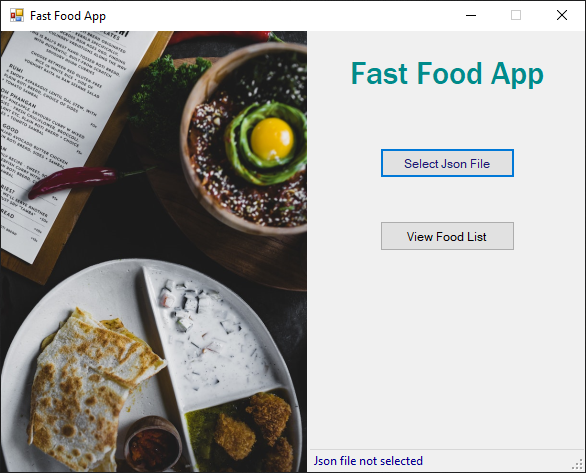

### Implementaciones:

- Uso de clases
- Manejo de excepciones
- Uso de validaciones
- Manipulación de archivos Json
- Uso de interfaz gráfica (Aplicación de windows form)
- Navegación entre formularios:
    ● formulario principal
    ● formulario ver comidas
    ● formulario agregar comida
    ● formulario editar comida

## Estructura de los elementos guardados en el archivo Json:

```` json
[
  {
    "Id": 0,
    "Name": "Empanadas de Jamon y queso",
    "Time": 20,
    "Price": 350,
    "Calories": 100,
    "Vegan": false
  },
  {
    "Id": 1,
    "Name": "Tortilla de papas",
    "Time": 20,
    "Price": 1350,
    "Calories": 180,
    "Vegan": false
  },
  {
    "Id": 2,
    "Name": "Salsa pesto",
    "Time": 90,
    "Price": 950,
    "Calories": 180,
    "Vegan": true
  }
]
````

## Screenshots:

- Vista principal

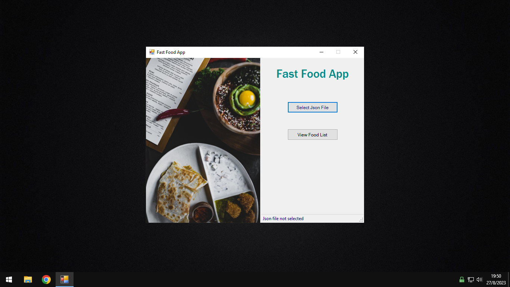

- Validación de archivo Json

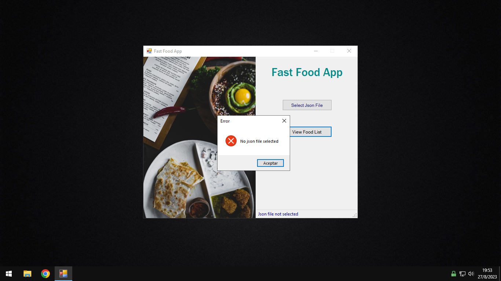

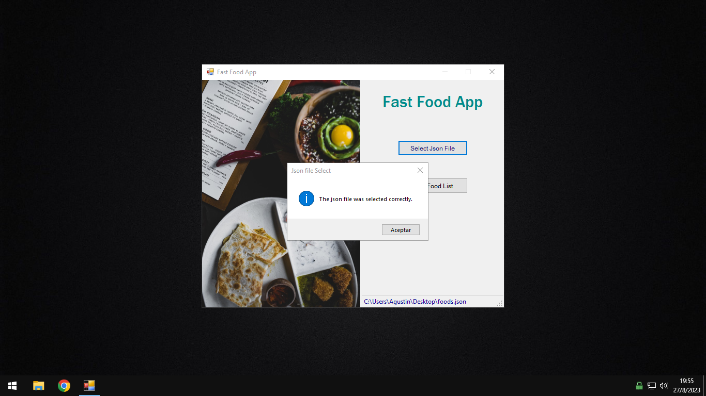

- Vista lista de comidas

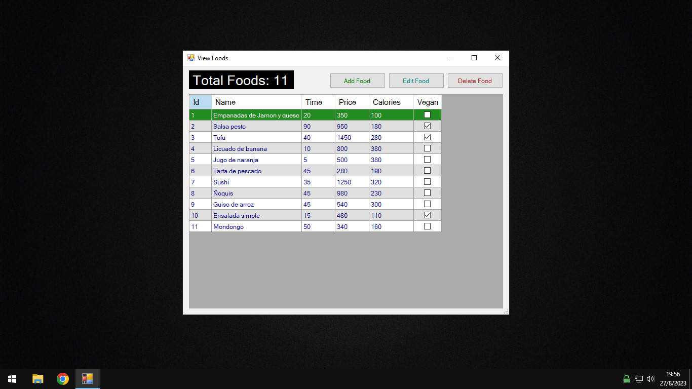

- Vista formulario agregar comida

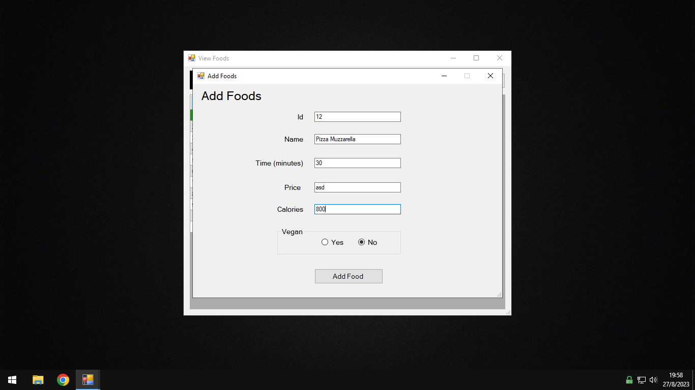

- Validaciones comida

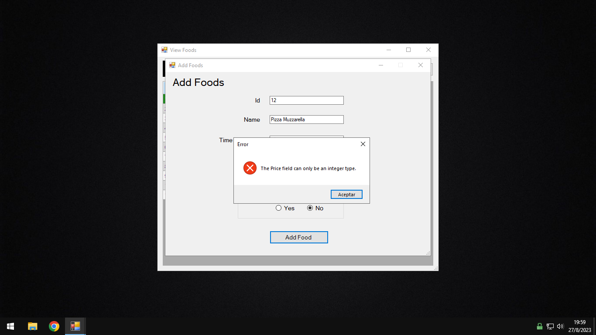

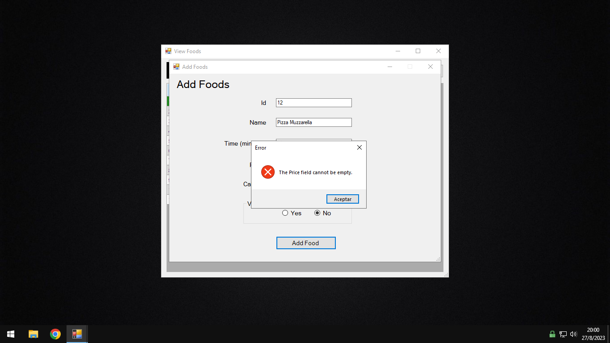

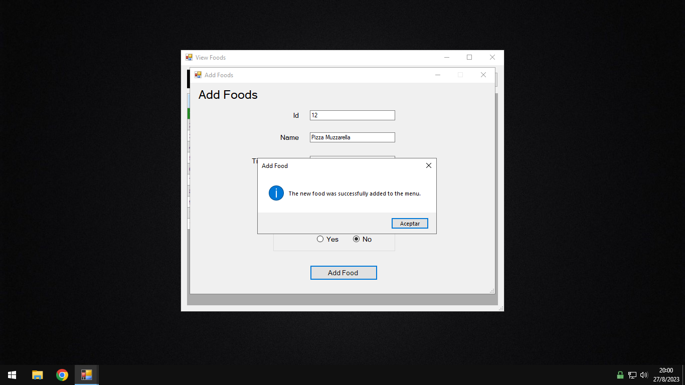

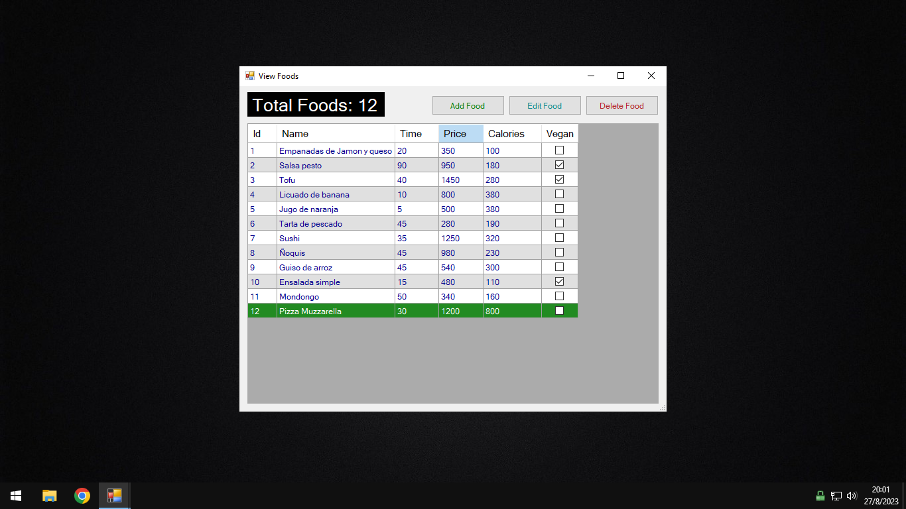

- Vista formulario editar comida

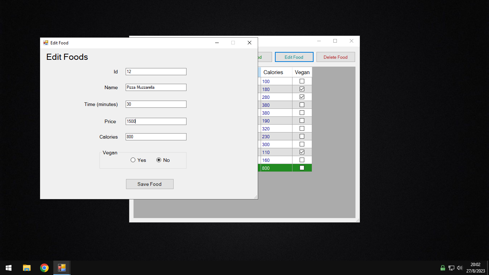

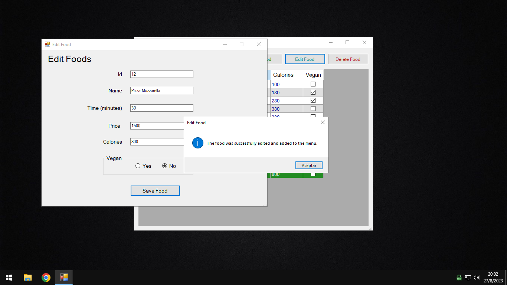

- Confirmación eliminar comida


